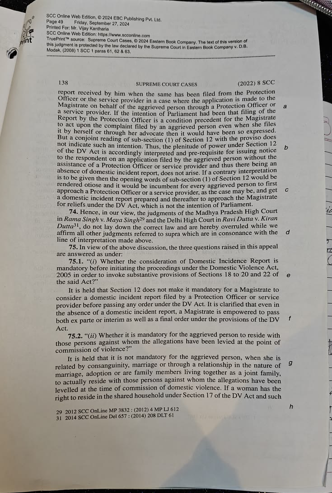
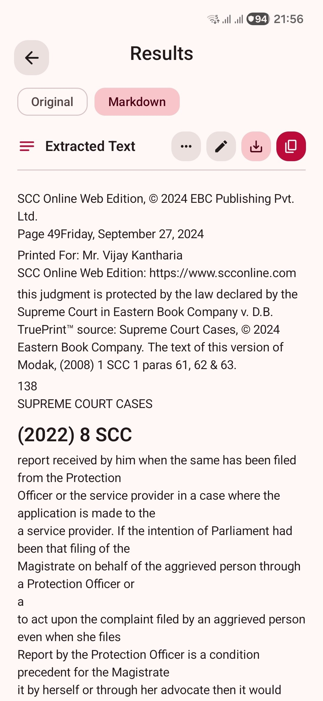
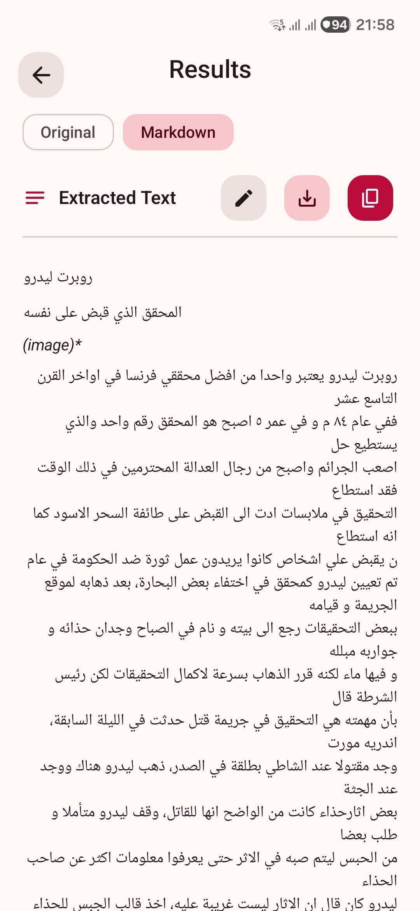

<div align="center">

# Scanly

**A private, offline-first document and barcode scanner for Android.**

Extract structured text on-device, use your preferred AI provider when needed, and export results
in practical formats.

[](https://github.com/Azyrn/Scanly/releases/latest)
[](https://github.com/Azyrn/Scanly/actions/workflows/quality.yml)
[](#requirements)
[](https://kotlinlang.org/)
[](LICENSE)

[Download Scanly](https://github.com/Azyrn/Scanly/releases/latest) ·
[View changelog](CHANGELOG.md) ·
[Telegram](https://telegram.me/ScanlyOCR)
</div>

## Preview

<table>
  <thead>
    <tr>
      <th align="center">Original</th>
      <th align="center">Scanly result</th>
    </tr>
  </thead>
  <tbody>
    <tr>
      <td align="center"></td>
      <td align="center"></td>
    </tr>
    <tr>
      <td align="center"></td>
      <td align="center"></td>
    </tr>
  </tbody>
</table>

## Highlights

- **Offline OCR:** PaddleOCR PP-OCRv6 runs entirely on-device through ONNX Runtime—no account,
  API key, or internet connection required.
- **Optional AI scanning:** Transcribe handwriting, forms, receipts, tables, and complex layouts with
  the provider and model you choose.
- **Structured results:** Review rendered Markdown, switch to plain text, edit the result, translate
  it into 18 languages, or create a short, medium, or detailed summary.
- **Flexible exports:** Save as PDF, Word (`.docx`), Markdown, CSV, or JSON. Printing and
  Save as PDF are also available through Android's system dialog.
- **Smart barcode actions:** Open links, join Wi-Fi networks, call numbers, send messages, save
  contacts, add calendar events, and look up supported products.
- **Modern Android UI:** Built entirely with Jetpack Compose and Material 3 Expressive, including
  dynamic color, dark mode, and a pure-black OLED theme.

## Scanning modes

| Mode | Network | Best for |
| --- | --- | --- |
| Offline OCR | Not required | Printed documents, tables, and private on-device processing |
| AI Scan | Required | Handwriting, complex layouts, forms, receipts, and multi-page documents |
| Barcode scanner | Not required for scanning | QR codes, EAN, UPC, ISBN, and content-aware actions |

### Offline OCR

The built-in OCR pipeline handles text detection, orientation, recognition, layout, and tables.
Universal Latin/Chinese/Japanese and Arabic models are included. Korean, Cyrillic, Devanagari,
Thai, Greek, Tamil, and Telugu packs can be downloaded once and then used offline.

### AI Scan

Scanly supports Gemini, Mistral OCR, OpenRouter, Hugging Face, NVIDIA, Groq, Cerebras, Cloudflare
Workers AI, OpenAI, Claude, and custom OpenAI-compatible endpoints. AI results stream as they are
generated when the selected provider supports streaming.

Personal API keys are encrypted with AES-GCM using Android Keystore. Requests go directly from
your device to the selected provider—Scanly does not operate an intermediary server or proxy.
Bundled free-tier credentials are available for selected providers, but the app never silently
replaces a personal key with a bundled one.

## Results and exports

Scanly keeps the visible result consistent across editing, copying, printing, and exporting.
Exported files are saved to `Downloads/Scanly` with an editable filename suggested from the text.

| Format | Output |
| --- | --- |
| PDF | Paginated rendered document with repeating table headers |
| Word | Editable headings, emphasis, lists, and tables |
| Markdown | Original structured text |
| CSV | Tables from the current result |
| JSON | Text, confidence, page numbers, and per-line bounding boxes |

## Privacy

Offline OCR, barcode detection, exports, and scan history stay on your device. Nothing is uploaded
unless you start an AI Scan or translation.

When you use an AI feature, the selected image, document, or text is sent directly to the provider
you chose. Product lookup sends only the scanned barcode number to the relevant public database.
Scanly does not track document contents or send them in the background.

## Install

Download the latest APK from [GitHub Releases](https://github.com/Azyrn/Scanly/releases/latest).
Release notes identify the available device architecture; choose the universal APK when one is
provided and you are unsure which architecture your device uses.

Android may ask you to allow installation from your browser or file manager when sideloading the
APK.

## Build from source

### Requirements

- Android SDK 37
- JDK 21
- Android 7.0 (API 24) or newer target device

```bash
git clone https://github.com/Azyrn/Scanly.git
cd Scanly
./gradlew assembleDebug
```

The debug APK is written to `app/build/outputs/apk/debug/`. Offline OCR, barcode scanning, and
exports work without additional configuration.

Cloud AI keys can be added inside the app. For local release builds, supported keys and signing
values may also be placed in the gitignored `local.properties` file.

Run the main project checks with:

```bash
./gradlew lint testDebugUnitTest assembleDebug
```

## Technology

Kotlin 2.4.10 · Jetpack Compose · Material 3 Expressive · Hilt · DataStore · ONNX Runtime ·
ML Kit · ZXing-C++ · CameraX · Retrofit · Android Keystore

## License

Scanly is licensed under the [Apache License 2.0](LICENSE). Third-party notices are listed in
[NOTICE](NOTICE).
